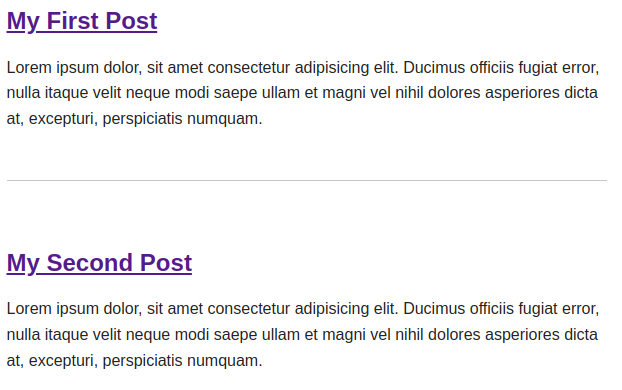
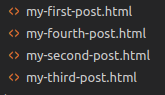
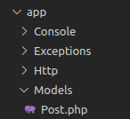

[<Volver](../Readme.md)

# SECTION 2: The Basics

1. Se comienza analizando el archivo de rutas, el código para generar la ruta inicial utilizado es el siguiente:
    `Route::get('/', function () {
        return view('welcome');
    });`

2. Se crea un archivo .css y un archivo .js en la carpeta *resourses* para conectarlos con las vistas, se utiliza el siguiente código para cargarlos:
   `<link rel="stylesheet" href="/app.css">`

3. Se genera una ruta desde el archivo *web* a la vista *posts.blade.php*, se cambió el nombre de welcome a posts, se utiliza el siguiente código:
    `Route::get('/', function () {
        return view('posts');
    });` 

4. Se generan artículos que se agregan a la vista *posts.blade.php*, viéndose de la siguiente forma:
   

5. Se crean archivos .html para cargar vistas de los posts:
   

6. Se crean rutas para acceder a los posts al hacer click en ellos, se utiliza el siguiente código:
    `Route::get('posts/{post}', function ($slug) {
        $path = __DIR__ . "/../resources/posts/{$slugs}.html";
        if (! file_exists($path)) {
            return redirect('\')
        }
        $post = file_get_contents($path);
        return view('post', [
            'post' => $post 
        ]);
    })`

7. Se agregan restricciones a las direcciones de los posts, con el siguiente código:
    `->where('post', '[A-z_\-]+')`

8. Utilizamos la memoria cache para guardar archivos que cargamos y no estarlos cargando cada vez que el usuario realice un evento, esto se realizó con el 
    siguiente código:
    `$post = cache()->remember("posts.{$slug}", 1200, fn() => file_get_contents($path));`

9. Creamos una clase o  modelo llamada *Post* para realizar algunos métodos como buscar, se debe ubicar en la carpeta *Models* del directorio *app*:
    

10. Se programan los métodos de buscar un archivo y encontrar todos los archivos. se utilizan los siguientes códigos:
    `public static function find($slug) {
        if (!file_exists($path = resource_path("posts/{$slug}.html"))){
            throw new ModelNotFoudException();
        }
        return cache()->remember("posts.{$slug}", 1200, fn() => file_get_contents($path));
    }`

    `public static function all() {
        $files = File::files(resourse_path("posts/"));
        return array_map(fn($file) => $file->getContents(), $files);
    }`

11. Generamos la sección "matter" para identificar los archivos html de los posts, mediante los siguientes códigos:
    `---
    title: My First Post
    excerpt: Lorem ipsum dolor
    date: 091022
    slug: my-first-post
    ---`

12. En el modelo *Post* creamos una colleción de archivos que se leen de una ruta, se cargan en un "arreglo" (collect), utilizando el siguiente código:
    `public static function all() {
        collect(File::files(resource_path("posts")))
            -> map(fn($file) => YamlFrontMatter::parseFile($file)) 
            -> map(fn($document) => new Post($document->title, $document->excerpt, $document->date, $document->body(), $document->slug)
            ) -> sortBy('date');
        });
    }`

13. Aún los archivos html se cargan según su nombre, queremos que se ordenen según su fecha de creación, además se agrega la opción de que la cache recuerde los archivos cargados, esto se logra con el siguiente código:
    `public static function all() {
        return cache() -> rememberForever('posts.all', function() {
            return collect(File::files(resource_path("posts")))
            -> map(fn($file) => YamlFrontMatter::parseFile($file)) 
            -> map(fn($document) => new Post($document->title, $document->excerpt, $document->date, $document->body(), $document->slug)
            ) -> sortBy('date');
        });
    }`