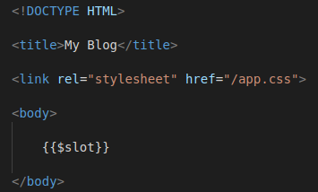

[<Volver](../Readme.md)

# SECTION 3: Blade

1. Con la extensión *blade*, podemos utilizar la siguiente expresión `{{$post->title}}` en lugar de esta expresón: `<?php echo $post->title; ?>`, ya que Laravel compila la información para que se traduzca de php a html.

2. Los condicionales y loops los podemos cambiar de `<?php if (true) : ?>` a `@if (true)`, pero debemos agregar un `@endif`.

3. Construimos layouts, que pueden ser utiles para cargar un mismo encabezado o secciones generales a varias vistas, sin tener que modificar una por una, para esto construimos una vista general llamada *layout.blade.php*:
    

4. En la sección de referencia, creamos el contenido, mediante el siguiente código, en la vista *posts.blade.php*:
    `<x-layout>

        @foreach ($posts as $post)
            <article>
                <h1>
                    <a href="/posts/{{$post->slug}}">
                        {{$post->title}}
                    </a>
                </h1>
                

                    {!!$post->body!!}
                

            </article>
        @endforeach

    </x-layout>`

5. Retomando el tema de las routas no válidas, desarrollamos en el modelo *Post*, un par de funciones, la primera nos permite encontrar el archivo de la ruta especificada:
    `public static function find($slug) {
        return static::all() -> firstWhere('slug', $slug);
    }`

mientras que la segunda, valida si se encontró el archivo, de lo contrario, devuelve una excepción de no encontrado (404).
    `public static function findOrFail($slug) {
        $post = static::find($slug);
        if (!$post) {
            throw new ModelNotFoundException();
        }
        return $post;
    }`