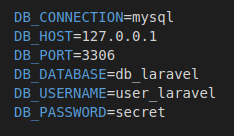
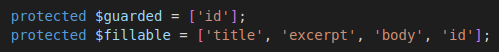
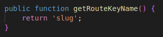
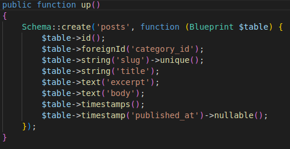
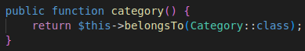
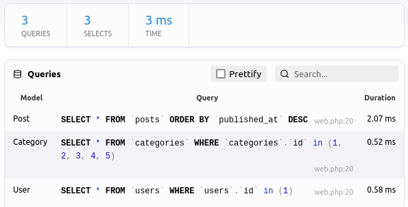

[<Volver](../Readme.md)

# SECTION 4: Working With Databases

1. Se inicia conociendo el archivo .env que crea Laravel por defecto, donde se ubica la configuración de la base de datos:
    

2. Mediante el uso del comando `php migrate`, podemos controlar las tablas de la base de datos.

3. Mediante el comando `php artisan tinker`, ingresamos un usuario a la base de datos:
    `>>> $user = new App\Models\User;
    => App\Models\User {#3609}

    >>> $user->name = 'Jean Carlos';
    => "Jean Carlos"

    >>> $user->email = 'rodriguezdiazjc@gmail.com';
    => "rodriguezdiazjc@gmail.com"

    >>> $user->password = bcrypt('123');
    => "$2y$10$Z9TTRr6lf9F4JOtcsYClLObbWpJszxgK8R3QY6pNnPJjQnyHyLTR6"

    >>> $user->save();`

4. En la máquina virtual, procedemos a crear una tabla en la base de datos para almacenar los posts, utilizamos el código: `php artisan make:migration create_posts_table`.

5. Borramos el modelo *Post* que habíamos creado anteriormente de forma manual y lo creamos a partir del siguiente comando: `php artisan make:model Post`.

6. Vemos que si queremos almacenar código html en la base de datos y luego cargarlo a una vista, será necesario usar signos de exclamación, para indicar que es lenguaje html, de la siguiente forma: `{!!$post -> title!!}`.

7. Para controlar los asignamientos masivos, podemos indicar cuales campos pueden ser o no rellenados, utilizamos alguna de las siguientes opciones:
    

8. Podemos controlar las rutas con diferentes identificadores de los Posts, construimos un ejemplo en el que identificamos la ruta por la variable *slug*, mediante el siguiente código:
    `Route::get('posts/{post:slug}', function (Post $post) {
    return view('post', [
        'post' => $post
    ]);
    });`
Sin embargo, también debemos modificar el enlace de: `<a href="/posts/{{$post->id}}">` a: `<a href="/posts/{{$post->slug}}">`, para enviar slug como identificador.

9. Con la siguiente función podemos definir la llave para identificar cada ruta desde el modelo:
    

10. Vamos a asociar los post a categorías, por lo que mediante el comando: `php artisan make:model Category -m`, el comando `-m` nos permite crear también la migración.

11. Se actualiza la tabla *Post* para incluir la llave relacionada a la categoría:
    

12. En la vista de los Posts se genera un enlace a la categorya, mediante el siguiente código: `<a href="#">{{$post->category->name}}</a>`.

13. Se utilizan dos tipos de relaciones, *hasMany* y *belongsTo*, para crear las relaciones entre los posts y las categorías, en la imagen se muestra un ejemplo:
    

14. Como debemos estar refrescando la base de datos, vemos el uso de los *seeders*, con el siguiente código:
    `public function run()
    {
        User::truncate();
        Post::truncate();
        Category::truncate();

        $user = User::factory()->create();

        $personal = Category::create([
            'name' => 'Personal',
            'slug' => 'personal'
        ]);
        $family = Category::create([
            'name' => 'Family',
            'slug' => 'family'
        ]);
        $work = Category::create([
            'name' => 'Work',
            'slug' => 'work'
        ]);

        Post::create([
            'user_id' => $user->id,
            'category_id' => $family->id,
            'title' => 'My Family Post',
            'slug' => 'my-family-post',
            'excerpt' => 'Lorem ipsum dorlar sit amet.',
            'body' => 'Lorem ipsum dolor sit amet consectetur adipisicing elit. Et illum quidem dolor repellendus ducimus illo doloremque perspiciatis at. Veniam nam ad, dolor id animi harum ut alias modi illo ea.'
        ]);

        Post::create([
            'user_id' => $user->id,
            'category_id' => $work->id,
            'title' => 'My Work Post',
            'slug' => 'my-work-post',
            'excerpt' => 'Lorem ipsum dorlar sit amet.',
            'body' => 'Lorem ipsum dolor sit amet consectetur adipisicing elit. Et illum quidem dolor repellendus ducimus illo doloremque perspiciatis at. Veniam nam ad, dolor id animi harum ut alias modi illo ea.'
        ]);`
        Esto para al refrescar la base de datos con este comando `php artisan migrate:fresh --seed` y al mismo tiempo volver a alimentar la base de datos, ahorrandonos tiempo para pruebas.
    }

15. Creamos factories para Post, Category y User, de manera que al alimentar la base de datos, en el factory de Post, creamos tanto el usuario como la categoria, con el siguiente código:
    `public function definition()
    {
        return [
            'user_id' => User::factory(),
            'category_id' => Category::factory(),
            'title' => $this->faker->sentence,
            'slug' => $this->faker->slug,
            'excerpt' => $this->faker->sentence,
            'body' => $this->faker->paragraph
        ];
    }`.
    De esta manera alimentamos la base datos con las relaciones establecidas en las migraciones.

16. Modificamos el código del DatabaseSeeder, para que al crear un Post, lo asocie a un usuario ya existente en la base de datos, en este caso *John Doe*, con este código:
    `public function run()
    {
        $user = User::factory()->create([
            'name' => 'John Doe'
        ]);
        Post::factory(5)->create([
            'user_id' => $user->id
        ]);
    }`.

17. Agregamos a las rutas la cegoría y el autor, con el objetivo de no generar consultas de más a la base de datos, utilizamos el siguiente código: 
    `Route::get('/', function () {
        return view('posts', [
            'posts' => Post::latest('published_at')->with(['category', 'author'])->get()
        ]);
    `});, mediante la extensión *Clockwork*, se observan ahora pocas consultas:
        
    
18. En el archivo de rutas, agregamos una ruta a las vistas *Post* y *Posts*, para poder ver los posts por cada usuario (autor), se agrega el siguiente código:
    `Route::get('authors/{author:username}', function(User $author) {
        return view('posts', [
            'posts' => $author->posts 
        ]);
    });`.

19. Para evitar tener que agregar la consulta por categoría y autor a cada ruta, podemos agregar en el modelo el siguiente código: `  protected $with = ['category', 'author']`, de esta manera, al consultar un Post, nos traerá también la categoría y el autor (usuario).