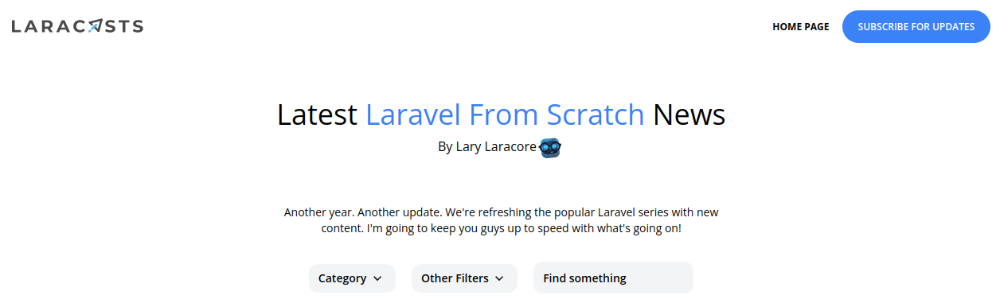
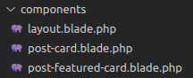
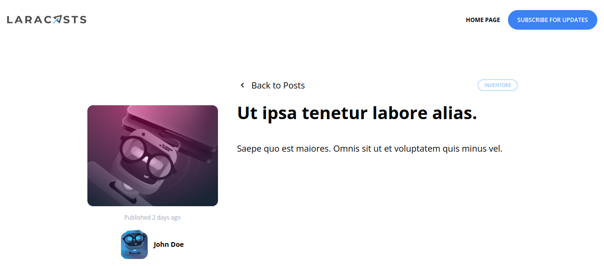
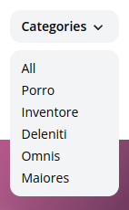
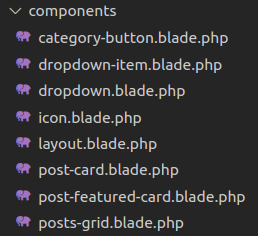

[<Volver](../Readme.md)

# SECTION 5: Integrate the Design

1. Descargamos un paquete de imagenes y archivos .html necesarios para esta sección, se descargan del siguiente link: https://github.com/laracasts/Laravel-From-Scratch-HTML-CSS.
    Del archivo *index.html* copiamos el código y lo pegamos en la vista *posts.blade.html*, debe verse como la siguiente imagen:

    
    
    También creamos vistas componentes, para cargar los artículos y el encabezado, nuestra carpeta de componentes ahora cuenta con tres vistas como se muestra en la imagen:

    

2. Reorganizamos la vista para mostrar un post principal, luego dos y luego tres, para esto debemos crear una vista "layout" llamada *posts-grid.blade.php* y la llamamos en la vista *posts.blade.php*, en la vista posts-grid.blade.php, incluimos el siguiente código:
    `@if($posts->count() > 1)
        

            @foreach($posts->skip(1) as $post)
                <x-post-card :post="$post" class="{{$loop -> iteration < 3 ? 'col-span-3' : 'col-span-2'}}"/>
            @endforeach
        

    @endif`.
es importante considerar que se debe agregar las props en las vistas *post-card.blade.php*, *post-featured-card.blade.php* y *posts-grid.blade.php*, mediante el código: `@props(['posts'])`
3. Le damos aspecto dinámico a la vista *post.blade.php*, utilizando el machote que descargamos del link mencionado al inicio, el código de la vista es el siguiente:
`    <section class="px-6 py-8">
        <main class="max-w-6xl mx-auto mt-10 lg:mt-20 space-y-6">
            <article class="max-w-4xl mx-auto lg:grid lg:grid-cols-12 gap-x-10">
                

                    

                    

                        Published <time>{{$post->created_at->diffForHumans()}}</time>
                    

                    

                        
                        

                            <h5 class="font-bold">{{$post->author->name}}</h5>
                        

                    

                

                

                    

                        <a href="/"
                            class="transition-colors duration-300 relative inline-flex items-center text-lg hover:text-blue-500">
                            <svg width="22" height="22" viewBox="0 0 22 22" class="mr-2">
                                <g fill="none" fill-rule="evenodd">
                                    <path stroke="#000" stroke-opacity=".012" stroke-width=".5" d="M21 1v20.16H.84V1z">
                                    </path>
                                    <path class="fill-current"
                                        d="M13.854 7.224l-3.847 3.856 3.847 3.856-1.184 1.184-5.04-5.04 5.04-5.04z">
                                    </path>
                                </g>
                            </svg>

                            Back to Posts
                        </a>

                        

                            <x-category-button :category="$post->category"/>
                        

                    

                    <h1 class="font-bold text-3xl lg:text-4xl mb-10">
                        {{$post->title}}
                    </h1>

                    

                        {{$post->body}}
                    

                

            </article>
        </main>
    </section>`.
Y debe verse como la siguiente imagen:

4. Vamos a crear un menú de opciones para las categorías, para esto vamos a hacer uso de javascript, ocupamos el siguiente código: ``, damos formato y función dinámica a las opciones del menú de categorías, mediante el siguiente código: 
    `

            <button @click="show = !show" class="py-2 pl-3 pr-9 text-sm font-semibold w-full lg-w text-left flex lg:inline-flex">
                {{ isset($currentCategory) ? ucwords($currentCategory->name) : 'Categories'}}
                <svg class="transform -rotate-90 absolute pointer-events-none" style="right: 12px;" width="22"
                    height="22" viewBox="0 0 22 22">
                    <g fill="none" fill-rule="evenodd">
                    <path stroke="#000" stroke-opacity=".012" stroke-width=".5" d="M21 1v20.16H.84V1z"></path>
                    <path fill="#222" d="M13.854 7.224l-3.847 3.856 3.847 3.856-1.184 1.184-5.04-5.04 5.04-5.04z"></path>
                    </g>
                </svg>
            </button>
            

                <a href="/" class="block text-left px-3 text-sm leading-6 hover:bg-blue-500 focus:bg-blue-500 hover:text-white focus:text-white">All</a>
                    @foreach($categories as $category)    
                        <a href="/categories/{{$category->slug}}" class="block text-left px-3 text-sm leading-6 hover:bg-blue-500 focus:bg-blue-500 hover:text-white focus:text-white {{isset($currentCategory) && $currentCategory->is($category) ? 'bg-blue-500 text-white' : ''}}">{{ucwords($category->name)}}</a>
                    @endforeach
            

    
` las categorías ahora deben dirigirnos a una vista donde se muestren todos los posts relacionados a esa categoría, en la siguiente imagen se muestra el menú de opciones de las categorías:

5. Haremos el código más limpio utilizando vistas componente, para esto debemos crear las vistas: *category-button.blade.php*, *dropdown-item.blade.php*, *dropdown.blade.php* y *icon.blade.php*, nuestra carpeta de vistas componente debe verse ahora así:
   
   

Los códigos de los links que se generan del menú de opciones, mostrados anteriormente, se cargan de estas vistas creadas.

6. Si tenemos muchas categorías, el menú de opciones no se verá bien, por lo que debemos agregar el siguiente código para dar una altura máxima: `overflow-auto max-h-52`.
   Agregamos más post a la base de datos para probar estas mejoras, se actualiza el código de *PostFactory* para generar también código html al excerpt y al body, se agrega el siguiente código: `'excerpt' => '
' . implode('

', $this->faker->paragraphs(2)) . '
', 'body' => '
' . implode('

', $this->faker->paragraphs(6)) . '
',`, también hay que recordar que en las vistas, debemos actualizar el código para leer html, agregando signos de exclamación.