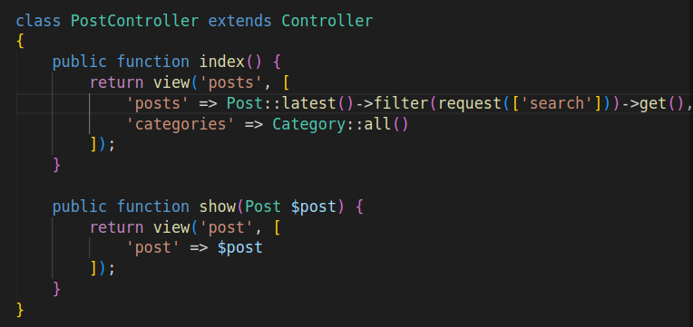

[<Volver](../Readme.md)

# SECTION 6: Search

1. Agregamos a las rutas, consultas con respecto al titulo del post y el cuerpo, con el siguiente código:
    `Route::get('/', function () {
    $posts = Post::latest();
    if (request('search')) {
        $posts->where('title', 'like', '%' . request('search') . '%')->orWhere('body', 'like', '%' . request('search') . '%');
    }
    return view('posts', [
        'posts' => $posts->get(),
        'categories' => Category::all()
    ]);
    })->name('home');`.
    También agregamos al form, el siguiente código: `value="{{request('search')}}`, esto para que cuando el usuario busque quede en el cuadro de texto, la palabra o frase que buscaba.

2. Vamos a ordenar las consultas, para esto debemos crear un controlador, mediante el comando: `php artisan make:controller PostController`, en el controlador cargamos las consultar, como se muestra en la imagen siguiente:

    
    
Además en el modelo debemos agregar la función *scopeFilter*, con el siguiente código:
    `public function scopeFilter($query, array $filters) {
        $query->when($filters['search'] ?? false, fn($query, $search) => $query->where('title', 'like', '%' . $search . '%')->orWhere('body', 'like', '%' . $search . '%'));
    }`.