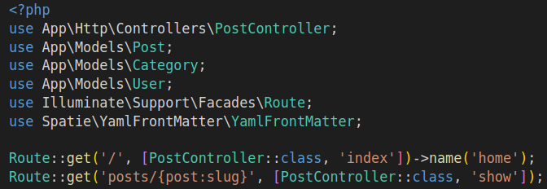

[<Volver](../Readme.md)

# SECTION 7: Filtering

1. Combinamos las búsquedas por categoría y por filtro, el filtro que se realizaba anteriormente con las categorías, lo cambiamos por una búsqueda, para esto debemos agregar las siguientes consultas en un método en el modelo *Post*:
   `public function scopeFilter($query, array $filters) {
        $query->when($filters['search'] ?? false, fn($query, $search) => 
            $query
                ->where('title', 'like', '%' . $search . '%')
                ->orWhere('body', 'like', '%' . $search . '%')
        );

        $query->when($filters['category'] ?? false, fn($query, $category) => 
            $query->whereHas('category', fn($query) => 
                $query->where('slug', $category))
        );
    }`

2. Extraemos el menú de opciones de las categorías y lo colocamos en un componente aparte, solamente que esta vez creamos el componente desde la máquina virtual, con el siguiente comando: `php artisan make:component CategoryDropdown`, en el componente creamos las rutas relacionadas con las categorías, en la función render colocamos:
    `return view('components.category-dropdown', [
        'categories' => Category::all(),
        'currentCategory' => Category::firstWhere('slug', request('category'))
    ]);`
De esta manera ya no tendremos que estar llamando a las categorías en las demás rutas.

3. Al método *scopeFilter* del modelo *Post*, agregamos ahora la consulta para filtrar por autor, con el siguiente código: 
    `$query->when($filters['author'] ?? false, fn($query, $author) => 
    $query->whereHas('author', fn($query) => 
    $query->where('username', $author))`
Ahora actualizamos nuestro archivo de rutas, viéndose ahora de la siguiente manera:

    

4. Al querer filtrar por categoría y búsqueda, encontramos que la ruta se modifica para encontrar ya sea solo la categoría o la búsqueda, sin embargo, existe el caso de que queramos buscar por una palabra o frase y luego filtrar por categoría y viceversa, para esto debemos, en la vista *_header.blade.php*, agregamos el siguiente código en el form:
    `@if (request('category'))
        <input type="hidden" name="category" value="{{request('category')}}">
    @endif`
Esto solucionará buscar primero la categoría y luego filtrar por frase o palabra, pero para hacerlo de manera opuesta (primero palabra o frase y luego categoría), se debe agregar este código:
    `href="/?category={{$category->slug}}&{{http_build_query(request()->except('category'))}}"`, al componente *category-dropdown.blade.php*, con esto queda solucionado.

5. Existe un problema con los "falsos positivos" que generan las consultas por los filtros que establecimos en el paso anterior, de manera que se muestran post con categorías distintas a la seleccionada, por lo que se debe modificar la primer consulta del método *scopeFilter* del modelo *Post*, debe quedar de esta forma:
   `$query->when($filters['search'] ?? false, fn($query, $search) => 
        $query->where(fn($query) => 
            $query->where('title', 'like', '%' . $search . '%')
            ->orWhere('body', 'like', '%' . $search . '%')
        )
    );`, con esto se soluciona el error.