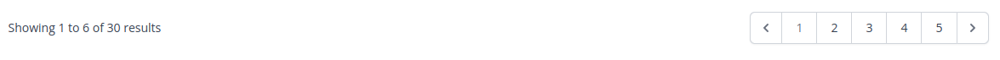

[<Volver](../Readme.md)

# SECTION 8: Pagination

1. Al tener muchos posts (30 en el ejercicio), si cargamos todos, la página se vuelve muy amplia, por lo que podemos utilizar el método de paginación, agregando `->paginate(6)` al método *index* del *PostController*, el número entre paréntesis, indica la cantidad de post a mostrar, al final de la página se muestra un navegador de páginas como el siguiente:
   

2. Al agregar la paginación, en la consulta se agrega el número de página, por lo que los filtros definidos en la sección anterior, se ven afectados, por lo que debemos excluir el número de página de la consulta, lo agregamos con el siguiente código: `{{http_build_query(request()->except('category', 'page'))}}`.